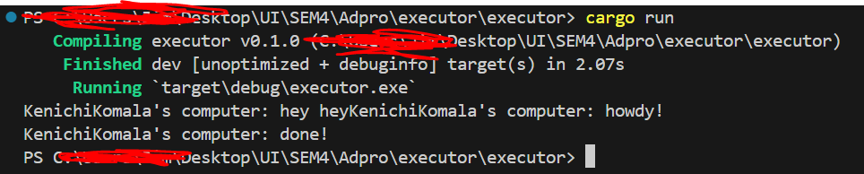
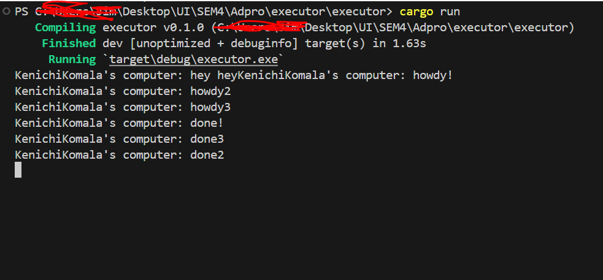

### 1.2. Understanding how it works.

Dari hasil pengamatan outputnya, dapat dipahami kalau yang terjadi adalah fungsi async akan berjalan diluar dari fungsi utama yang menjalankannya. Oleh karena itu, "hey hey" bisa saja menjadi output terlebih dahulu sebelum "howdy!" dan "done!" karena "hey hey" berada diluar fungsi async karena fungsi akan melanjutkan program dan menjalankan print!("hey hey"); saat fungsi async masih menunggu hasil dari future.

### 1.3. Multiple Spawn and removing drop

Dari hasil output yang dihasilkan, dapat dilihat kalau adanya banyak spawner menyebabkan lebih banyak task yang dilakukan karena lebih banyak task yang diantrikan kedalam task sender yang berlaku seperti sebuah message queue. Tidak di-dropnya spawner menyebabkan program tidak pernah mati karena program berasumsi kalau masih akan terjadi suatu pengiriman data oleh spawner. drop(spawner) sendiri merupakan indikasi kalau interaksi sudah selesai dan spawner akan ditutup.
Saat suatu spawner memanggil fungsi spawn, maka akan tercipta suatu task baru yang disalurkan kedalam task sender. Executor akan mengambil satu task dari task sender dan mengeksekusinya dan setelah itu mengambil lagi task hingga task habis dan spawner di drop yang menandakan interaksi selesai.